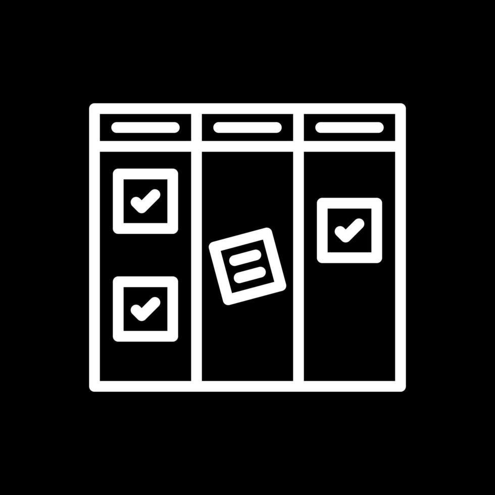

# Bitacora de desarrollo | PizzaDB 🍕

En esta documentación se detalla todo el desarrollo del proyecto PizzaDB, incluyendo:

✅ El progreso por secciones del sistema

🧠 Las decisiones técnicas y de diseño tomadas durante el desarrollo

📊 Las métricas y prácticas utilizadas bajo la metodología SCRUM

Este documento busca ofrecer una visión clara, ordenada y comprensible del proceso completo, desde la concepción inicial hasta la entrega final del proyecto.

## Planeación 📋

Durante la etapa de planeación, el equipo se reunió en una sesión inicial con el objetivo de alinear ideas, presentar el contexto general del proyecto y definir una visión compartida. Se realizó una lluvia de ideas entre los integrantes para establecer una ruta preliminar de desarrollo y acordar las primeras decisiones clave.

En la reunión de backlog, el Product Owner presentó los requerimientos del sistema junto con las historias de usuario, clasificadas en dos categorías:

- Requerimientos funcionales

- Requerimientos no funcionales

Se abrió un espacio de discusión para escuchar la perspectiva de cada integrante del equipo y resolver dudas sobre los entregables esperados.

Posteriormente, el SCRUM Master lideró la asignación de tareas, validando que cada desarrollador comprendiera su responsabilidad y asegurándose de identificar posibles bloqueos o dificultades antes de iniciar el sprint.

### Metodologia utilizada:

Metodologia KanBan:

  

