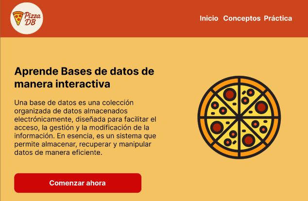
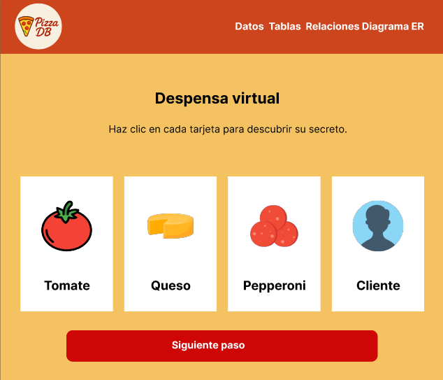
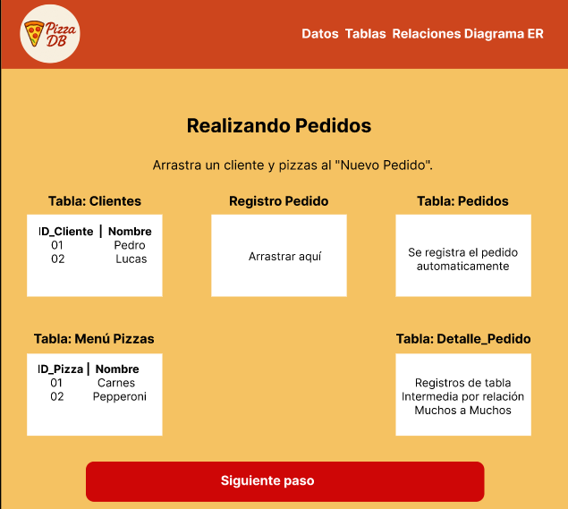
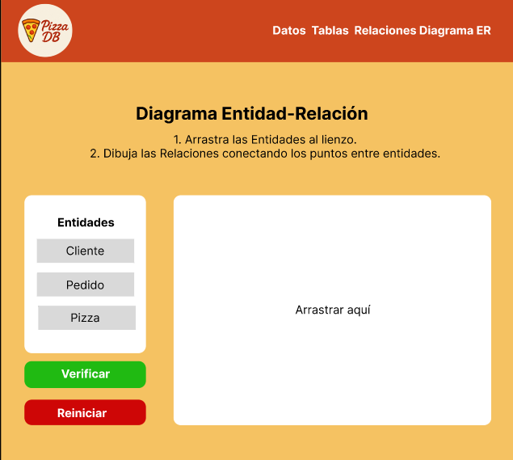

# Bitacora de desarrollo | PizzaDB 🍕

En esta documentación se detalla todo el desarrollo del proyecto PizzaDB, incluyendo:

✅ El progreso por secciones del sistema

🧠 Las decisiones técnicas y de diseño tomadas durante el desarrollo

📊 Las métricas y prácticas utilizadas bajo la metodología SCRUM

Este documento busca ofrecer una visión clara, ordenada y comprensible del proceso completo, desde la concepción inicial hasta la entrega final del proyecto.

## Planeación 📋

Durante la etapa de planeación, el equipo se reunió en una sesión inicial con el objetivo de alinear ideas, presentar el contexto general del proyecto y definir una visión compartida. Se realizó una lluvia de ideas entre los integrantes para establecer una ruta preliminar de desarrollo y acordar las primeras decisiones clave.

En la reunión de backlog, el Product Owner presentó los requerimientos del sistema junto con las historias de usuario, clasificadas en dos categorías:

- Requerimientos funcionales

- Requerimientos no funcionales

Se abrió un espacio de discusión para escuchar la perspectiva de cada integrante del equipo y resolver dudas sobre los entregables esperados.

Posteriormente, el SCRUM Master lideró la asignación de tareas, validando que cada desarrollador comprendiera su responsabilidad y asegurándose de identificar posibles bloqueos o dificultades antes de iniciar el sprint.


### Metodologia a implementar:

**Metodologia XP:**

<p align="center">  </p>

La razón por la que se eligió la metodología XP fue su enfoque en un desarrollo iterativo e incremental, orientado a entregar valor de forma constante. Esto permite una retroalimentación continua por parte del cliente y facilita los ajustes necesarios en cada iteración del proyecto.

## Maquetacion y diseño 📃

En esta etapa, junto con el Scrum Master y el equipo de desarrollo, se diseñaron las vistas que se planean implementar. Para ello, se dedicó una Daily Scrum a discutir estos aspectos, con el objetivo de alinear ideas y asegurar una mejor experiencia de usuario al momento de traducir el diseño en código.

### 🏠 Vista de inicio

<p align="center">  </p>

Se diseñó una interfaz cuya paleta de colores evoca el mundo de las pizzas. Para lograrlo, se utilizaron tonos cálidos y apetitosos: naranja en el encabezado, un fondo amarillo suave en todas las vistas y detalles en rojo para generar contraste y resaltar elementos clave. Además, se incorporó un mensaje de bienvenida para brindar una experiencia más amigable al usuario.


### 🧺 Vista de despensa virtual

<p align="center">  </p>

En esta sección se diseñó un espacio interactivo compuesto por tarjetas visuales, donde el usuario puede explorar y seleccionar diferentes elementos disponibles en la despensa.

Cada tarjeta presenta información específica sobre un producto, acompañada de una descripción breve que facilita su comprensión y permite una navegación intuitiva por el contenido.

### 🧾 Vista de pedidos

<p align="center">  </p>

En esta sección se maquetó una interfaz intuitiva compuesta por contenedores (cajas) que permiten al usuario arrastrar y soltar los elementos correspondientes a las distintas entidades necesarias para generar un pedido.

La acción de completar un pedido desencadena una breve retroalimentación visual o textual, que informa al usuario si la operación se realizó correctamente y resume los datos del pedido creado.

Esta funcionalidad busca brindar una experiencia de uso dinámica e interactiva, facilitando la comprensión del flujo de trabajo dentro del sistema.


### 🔗 Vista de Entidad - Relacion

<p align="center">  </p>

En esta sección, el usuario vivirá una experiencia interactiva diseñada para comprender cómo se relacionan las entidades en una base de datos, específicamente en el contexto del sistema de una pizzería.

Manteniendo la paleta de colores y estilo visual coherente con el resto del proyecto, se desarrolló un espacio donde el usuario puede arrastrar y conectar entidades de forma visual, simulando un diagrama entidad-relación.

Una vez establecidas las conexiones, el sistema permite verificar la solución, ofreciendo una retroalimentación explicativa sobre la lógica relacional y el papel de cada entidad dentro del modelo de datos.

Esta actividad refuerza el aprendizaje práctico sobre modelado de bases de datos de forma didáctica y contextualizada.

## Construcción HTML 🧱

La construcción del proyecto se organizó utilizando dos archivos principales en HTML: index.html y content.html.

- index.html funciona como la página de bienvenida. Es la primera vista que el usuario encuentra al ingresar, y cumple el propósito de introducir brevemente el proyecto.

- content.html contiene el desarrollo principal, donde se disponen las actividades interactivas y las explicaciones relacionadas con los fundamentos de bases de datos.

Inicialmente se consideró integrar todas las vistas en un único archivo HTML. Sin embargo, por buenas prácticas de organización y escalabilidad, se optó por separar la estructura en distintos archivos, facilitando así el mantenimiento y la claridad del código.

### index.html

```html
 <!-- ========== CUERPO PRINCIPAL ========== -->
<main class="overflow-x-hidden">

<!-- ======= Sección de Presentación ======= -->
<section id="inicio" class="container mx-auto px-6 py-16 lg:py-24">
<div class="grid lg:grid-cols-2 gap-12 items-center">

<!-- Texto principal -->
<div class="text-center lg:text-left">
<h1 class="text-4xl lg:text-5xl font-extrabold mb-4 leading-tight">
Aprende Bases de Datos, <br>
<span class="text-red-600">una rebanada a la vez.</span>
</h1>
<p class="text-lg text-stone-600 max-w-xl mx-auto lg:mx-0 mb-8">
Una explicación introductoria sobre qué es una base de datos, con un lenguaje accesible.
</p>

<!-- Botón de llamada a la acción -->
<a href="./html/content.html"
class="inline-block bg-red-600 text-white font-bold text-lg py-3 px-8 rounded-lg hover:bg-red-700 transition-all shadow-md hover:shadow-lg transform hover:-translate-y-1">
¡Comenzar Aventura!
</a>
</div>

<!-- Ilustración SVG de una pizza -->
<div class="flex items-center justify-center">
<svg width="300" height="300" viewBox="0 0 240 240" class="max-w-full h-auto">
<title>Ilustración de Pizza</title>
<g id="pizza-group">
<circle id="pizza-sauce" cx="120" cy="120" r="90" fill="#E53935"/> <!-- Salsa -->
<circle id="pizza-crust" cx="120" cy="120" r="100" fill="transparent" stroke="#FBC02D" stroke-width="20"/> <!-- Borde -->

<!-- Pepperonis animados -->
<circle class="pepperoni" cx="120" cy="80" r="18" fill="#C62828" style="animation-delay: 1.5s;" />
<circle class="pepperoni" cx="165" cy="110" r="18" fill="#C62828" style="animation-delay: 1.7s;" />
<circle class="pepperoni" cx="145" cy="165" r="18" fill="#C62828" style="animation-delay: 1.9s;" />
<circle class="pepperoni" cx="95" cy="165" r="18" fill="#C62828" style="animation-delay: 2.1s;" />
<circle class="pepperoni" cx="75" cy="110" r="18" fill="#C62828" style="animation-delay: 2.3s;" />
</g>
</svg>
</div>
</div>
</section>// Constante que contiene el API 
const API_URL = "https://fakestoreapi.com/products"
```

 Utiliza TailwindCSS para los estilos y una fuente moderna desde Google Fonts. La interfaz incluye un encabezado con navegación, una sección de bienvenida con una ilustración SVG de pizza, y una sección educativa donde se explican conceptos clave como "Datos", "Tablas" y "Relaciones", cada uno representado visualmente como ingredientes, menús y pedidos, respectivamente. También se incluye un pie de página con los créditos de los desarrolladores. Todo el diseño es responsivo, accesible y pensado para facilitar la comprensión de temas técnicos de forma lúdica y visual. Además, el documento carga estilos personalizados y un script JavaScript (index.js) que puede añadir interactividad adicional.

 ### Content.html 🪪

  La estructura del documento está organizada en secciones clave: un encabezado con navegación (nav), una introducción gráfica (section#hero) y un apartado educativo (section#info) que explica conceptos como datos, tablas y relaciones con analogías visuales. El diseño se basa en Tailwind CSS para estilos responsivos y modernos, y utiliza una fuente personalizada de Google Fonts. Además, se integran recursos visuales como imágenes SVG, íconos y una disposición en grid para mejorar la experiencia visual y pedagógica. El archivo incluye también un footer con créditos, y enlaza un archivo index.js que podría encargarse de comportamientos interactivos adicionales. Esta estructura facilita la comprensión progresiva de conceptos de bases de datos mediante una interfaz clara y atractiva.

