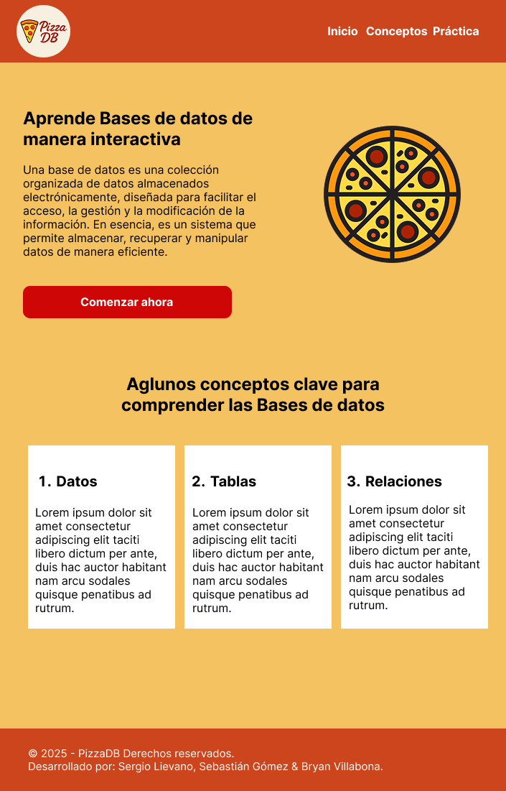
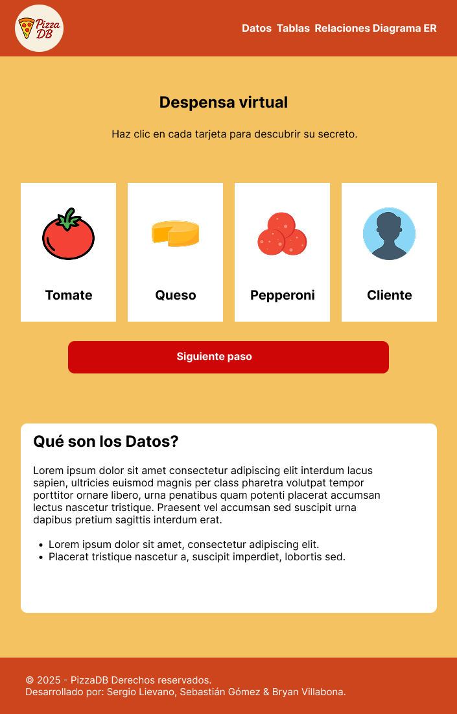
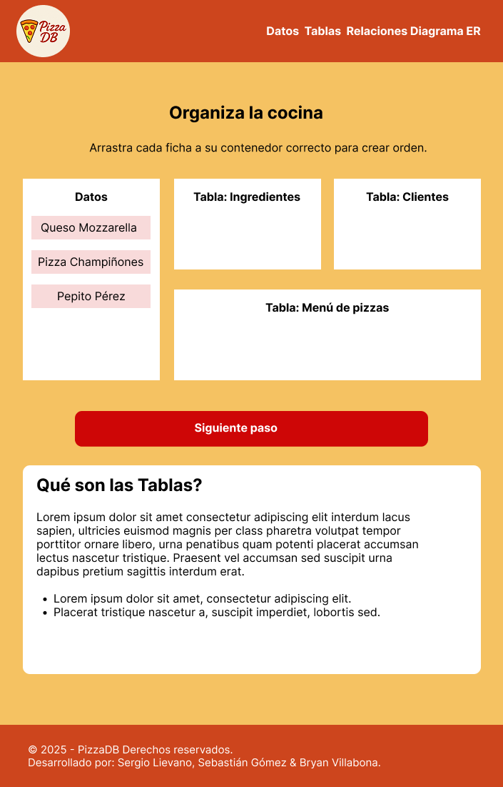
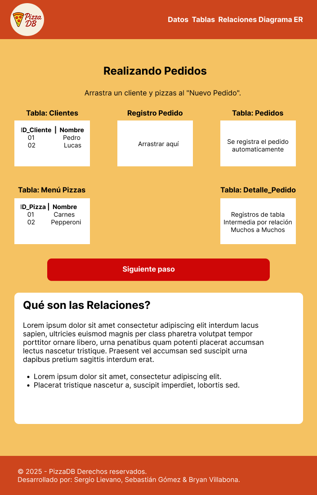
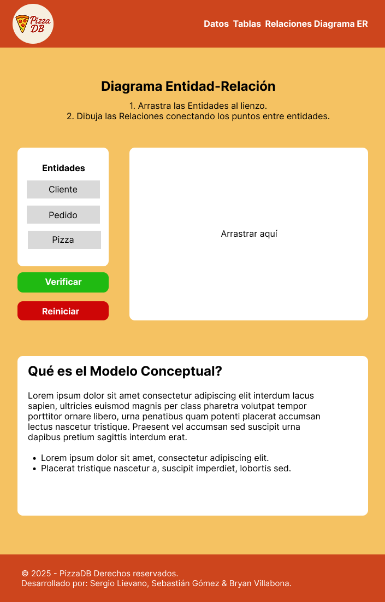
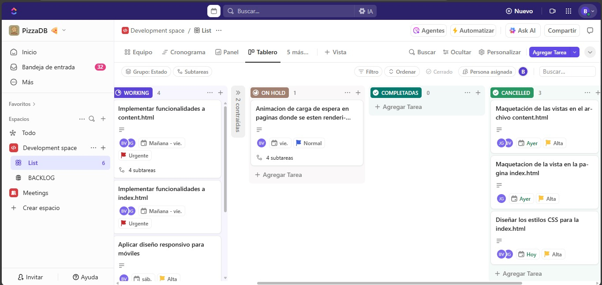

# PizzaDB  - Aprende Bases de Datos de Forma Interactiva

  


  

## 📖 Descripción General

  

**PizzaDB** es un recurso didáctico en formato de aplicación web, diseñado para enseñar los fundamentos de las bases de datos relacionales de una manera clara, creativa y comprensible. El proyecto busca desmitificar conceptos técnicos abstractos, haciéndolos accesibles para cualquier persona sin conocimientos previos en el área.

---

## 🚀 Demo en Vivo

  

Puedes probar la aplicación funcional en el siguiente enlace:

  

[**Acceder a PizzaDB**](https://sebas404040.github.io/PIZZADB/)

---

  

## 🎯 Enfoque Pedagógico: La Analogía de la Pizzería

  

Para explicar el tema, utilizamos una analogía central: **gestionar una pizzería**. Este enfoque permite relacionar los conceptos de bases de datos con un escenario del mundo real que todos podemos entender:

  

*  **Datos** son los ingredientes, los nombres de los clientes, los precios.

*  **Tablas** son los contenedores donde organizamos todo: la lista de clientes, el menú de pizzas, el inventario.

*  **Relaciones** son las conexiones que hacen que el negocio funcione: un cliente realiza un pedido, y un pedido contiene pizzas.

*  **Modelo Conceptual** es el plano que diseñamos antes de construir la pizzería para asegurarnos de que todo esté bien estructurado.

  

A través de 4 módulos interactivos, el usuario no solo lee sobre estos conceptos, sino que los "construye" y "manipula" directamente en la aplicación.

  

---

  

## ✨ Características Principales

  

La aplicación se divide en 4 pasos o módulos de aprendizaje secuenciales:

  

1.  **¿Qué es un Dato?**: El usuario interactúa con los "ingredientes" de la pizzería para descubrir el concepto de dato como unidad fundamental de información.

2.  **Organización en Tablas**: Mediante una interfaz de arrastrar y soltar, el usuario clasifica datos sueltos en sus tablas correspondientes (`Clientes`, `Pizzas`, etc.), aprendiendo sobre tablas y registros.

3.  **Creación de Relaciones**: El usuario simula la toma de un pedido, conectando clientes con pizzas. A través de un resaltado dinámico, visualiza cómo las claves primarias y foráneas crean relaciones sin repetir datos.

4.  **Diseño del Modelo Conceptual**: En un lienzo interactivo, el usuario se convierte en "arquitecto de datos", arrastrando entidades y dibujando las líneas que definen la estructura de la base de datos (Diagrama Entidad-Relación).

---
## 🛠️ Tecnologías Utilizadas

  

Este proyecto fue construido utilizando tecnologías web estándar del lado del cliente, sin necesidad de frameworks complejos ni backend.

  

*  **HTML5:** Para la estructura semántica del contenido.

*  **Tailwind CSS:** Para un diseño de interfaz de usuario moderno, responsivo y rápido.

*  **JavaScript (ES6+):** Para toda la lógica interactiva, manipulación del DOM y la gestión del estado de la aplicación.

* **TailWind CSS:** Framework CSS para diseño responsivo.

*  **Figma:** Diseño (prototipado/maquetación).

---
## Maquetación y Diseño (Figma)

El diseño de la interfaz de usuario de PizzaDB fue creado en Figma, siguiendo principios de diseño moderno y usabilidad. Aquí se muestran algunos de los wireframes y mockups clave que guiaron el desarrollo:

**Pantalla principal:**



**Página interactiva: Primer Paso**



**Página interactiva: Segundo Paso**



**Página interactiva: Tercer Paso**



**Página interactiva: Cuarto Paso**



**Link de Figma**: [Ver diseño completo en Figma](https://www.figma.com/proto/2F8LH7haW3AOzVYxsTzy62/PizzaDB?page-id=0%3A1&node-id=1-2&p=f&viewport=82%2C262%2C0.21&t=Ph1Nz5PJronizsEg-1&scaling=min-zoom&content-scaling=fixed)  

---

## ⚙️ Instrucciones de Instalación y Uso

  

Dado que es un proyecto web estático, no requiere un proceso de instalación complejo.

  

1.  **Clonar el repositorio:**

```bash

git clone https://github.com/Sebas404040/PIZZADB

```

  

2.  **Navegar a la carpeta del proyecto:**

```bash

cd PIZZADB

```

  

3.  **Abrir el archivo `index.html`:**

Simplemente abre el archivo `index.html` (o el archivo principal de tu proyecto) en tu navegador web preferido (Google Chrome, Firefox, etc.).

  

¡Y eso es todo! La aplicación se ejecutará localmente en tu navegador.

---
## Estructura de Archivos

```
PIZZADB/

├── css/
│     └── styles.css # Estilos personalizados
├── Docs/
│     ├── Documentation.pdf # Documentación detallada del aplicativo web
│	  └── Software Requeriments Specification  # Especificación de requisitos del software
├── js/
│     ├── main.js # Lógica principal de la aplicación para content.html
│	  └── index.js  # Lógica principal de la aplicación para index.html
├── img/
│     ├── logo.png # Logo principal del aplicativo web
│     ├── tomate.png # imagen para tarjetas
│	  ├── Queso.png # imagen para tarjetas
│	  └──  pepperoni.png # imagen para tarjetas
├── html/
│	  └──  content.html # página interactiva
├── index.html # Página principal del aplicativo
├── Bitacora.md
└── README.md
```
  
---
## Metodología SCRUM

  

El desarrollo de este proyecto se gestionó utilizando la metodología ágil **SCRUM** para organizar el trabajo, fomentar la colaboración y entregar valor de manera incremental.

  

### Tablero SCRUM

  

Utilizamos un tablero Kanban (en ClickUp) para visualizar el flujo de trabajo, dividido en columnas como `Product Backlog`, `Sprint Backlog`, `En Progreso` y `Finalizado`.

**Tablero Kanban hecho en ClickUp:**



Para visualizar mejor el tablero kanban, ingresa al siguiente link:
**Link de ClickUp**: [Ver tablero](https://sharing.clickup.com/90131987169/b/h/6-901316334983-2/770ee9b485479c3)  

  

---

  

## 📹 Video Explicativo

  

En el siguiente video, nuestro equipo presenta el proyecto, explica el contenido teórico y demuestra el funcionamiento de la aplicación **PizzaDB**.

  

[**Ver Video en YouTube**](https://[ENLACE-A-TU-VIDEO])

  

---

## 👥 Integrantes y Roles

  
| Nombre del Integrante | Rol en el Equipo | GitHub |
|---|---|---|
| Joan Sebastián Gómez | SCRUM Master | [@Sebas404040](https://github.com/Sebas404040)|
| Sergio Lievano | Product Owner | [@sergiosteven66](https://github.com/sergiosteven66)|
| Bryan Villabona | Desarrollador | [@BryanVillabona](https://github.com/BryanVillabona)|
